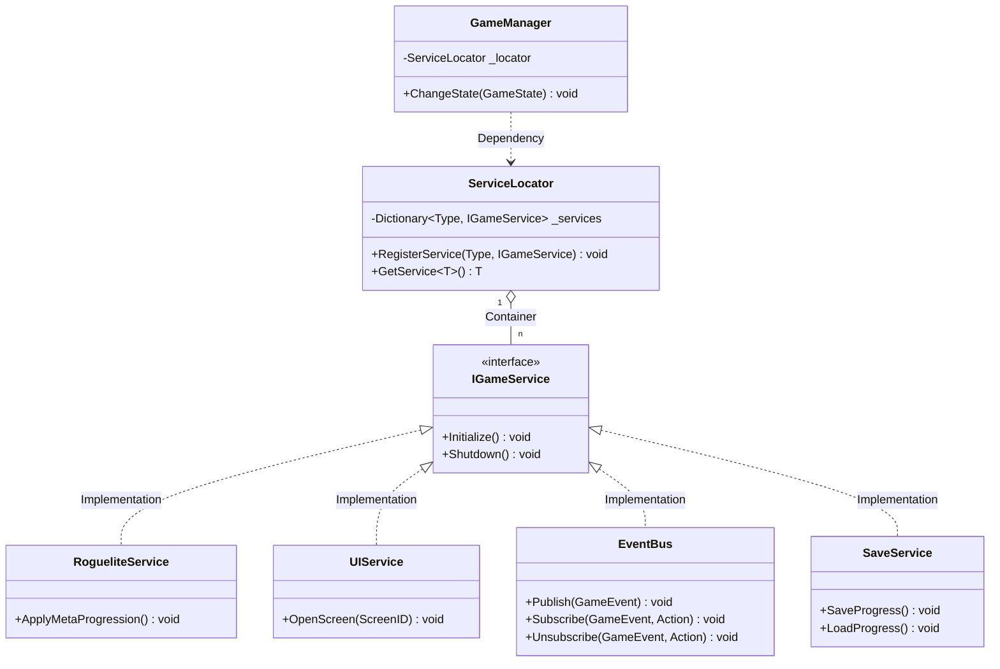
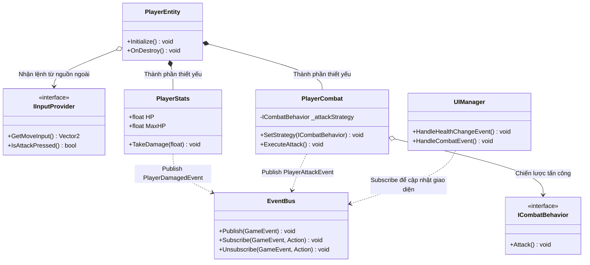
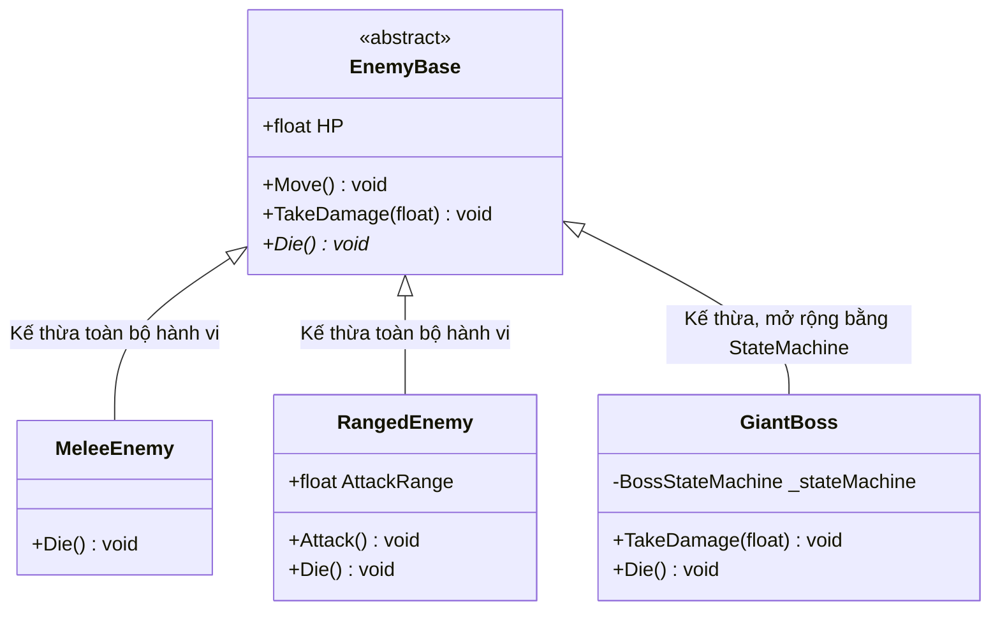
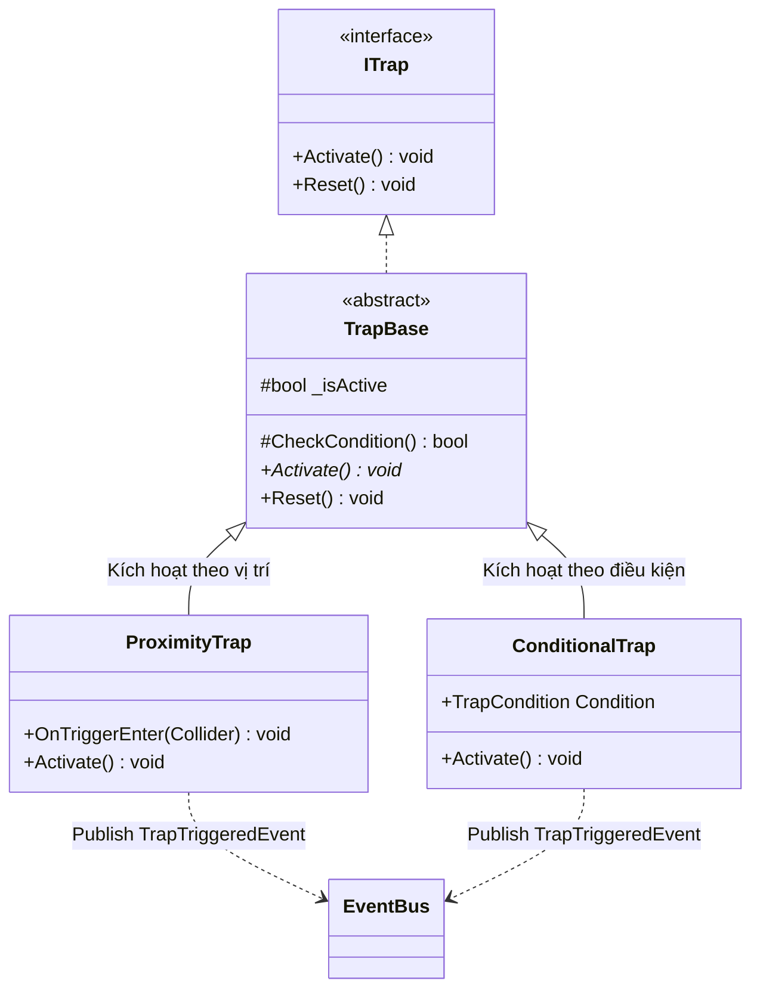
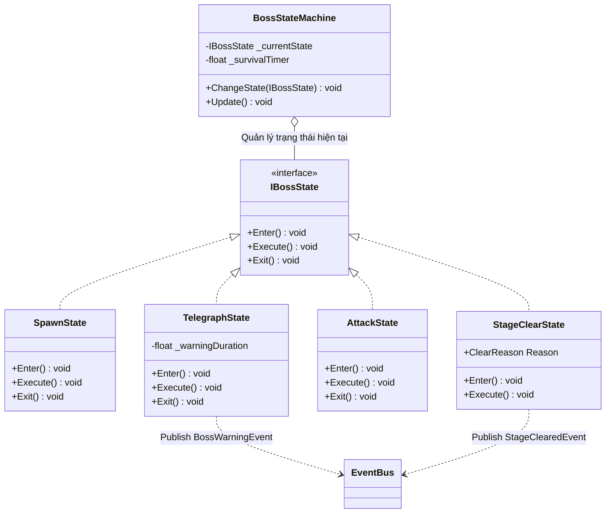
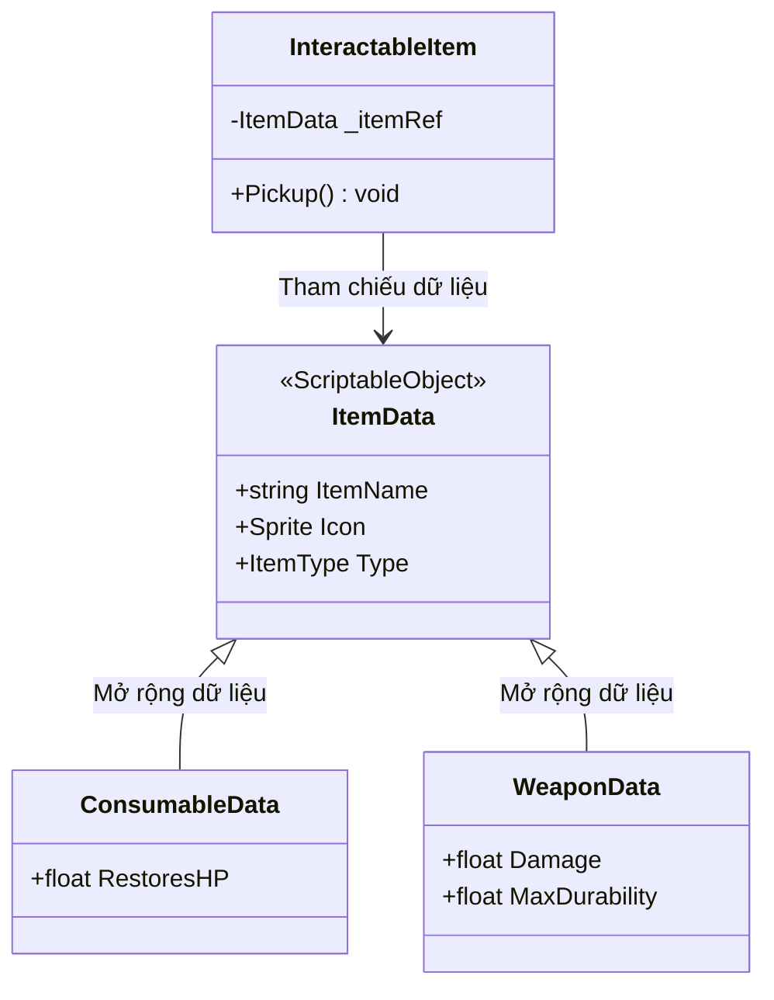

# Dự án Game: Ruins Beneath the Giants

## Tổng quan dự án

### Công nghệ ngôn ngữ sử dụng

- Engine: Unity
- Ngôn ngữ: C#
- Quản lý mã nguồn: Git

### Bối cảnh và cốt truyện

Trò chơi lấy bối cảnh trong một thế giới hậu tận thế nơi nhân loại đã sụp đổ và phải sinh tồn dưới chân những thực thể khổng lồ đầy bí ẩn được gọi là Giants. Người chơi hóa thân thành một kẻ sống sót phải băng qua các khu phố đổ nát, khu công nghiệp hoang tàn và những cánh rừng rậm nguy hiểm để tìm kiếm tài nguyên và con đường đến vùng an toàn.

---

## Thiết kế hệ thống chức năng

### 1. Hệ thống cốt lõi (Core Systems)

Hệ thống điều phối vòng lặp trò chơi, UI, lưu trạng thái và quá trình sản sinh môi trường.

#### Sơ đồ hệ thống: Service Locator & Interface (Decoupled Services)



#### Đặc điểm hệ thống

- Tuân theo nguyên tắc Dependency Inversion (SOLID)
- Các hệ thống giao tiếp với nhau thông qua interface
- `EventBus` là dịch vụ toàn cục, đăng ký vào `ServiceLocator` — tránh tạo instance cục bộ
- `SaveService` quản lý meta-progression cho thể loại Roguelite
- Dễ mở rộng, dễ tái sử dụng

---

### 2. Hệ thống người chơi (Player Systems)

Quản lý các tài nguyên, trạng thái của người chơi: di chuyển, trạng thái bất lợi, chiến đấu và kho đồ.

#### Sơ đồ hệ thống: Phân tách bằng Event Bus & Strategy (Event-driven Architecture)



#### Lưu ý quan trọng

- `EventBus` được lấy qua `ServiceLocator.GetService<EventBus>()`, **không** khởi tạo cục bộ trong `PlayerEntity`
- Bắt buộc gọi `Unsubscribe` trong `OnDestroy()` để tránh memory leak khi entity bị hủy

---

### 3. Hệ thống Bẫy và Trùm (Trap & Boss Systems)

#### 3.1 Hệ thống kẻ thù thông thường

Mô hình cây kế thừa cho các loại kẻ thù.



---

#### 3.2 Hệ thống bẫy (Trap System)

Bẫy không kế thừa từ `EnemyBase` — không có HP, không di chuyển, không có AI. Thiết kế tách biệt theo nguyên tắc Interface Segregation (SOLID).



---

#### 3.3 Boss State Machine (GiantBoss)

Điều phối AI của Boss qua các trạng thái rõ ràng.



#### Luồng chuyển trạng thái

```
Spawn ──► Telegraph ──► Attack ──┬──► Telegraph  (lặp lại cho đến khi kết thúc)
                                  │
                                  └──► StageClear
                                           ├── Reason.BossDied   (boss bị tiêu diệt)
                                           └── Reason.TimerEnded (người chơi sống sót đủ thời gian)
```

#### Lưu ý quan trọng

- `SurvivalTimer` đặt trong `BossStateMachine`, chạy xuyên suốt các lần lặp Telegraph → Attack, **không** đặt bên trong `AttackState`
- `TelegraphState` publish `BossWarningEvent` lên `EventBus` để UI hiển thị chỉ báo hướng tấn công
- `StageClearState` phân biệt 2 lý do clear qua enum `ClearReason` — phục vụ logic drop loot và điểm số khác nhau

---

### 4. Hệ thống Vật phẩm và Kho đồ (Item & Inventory Systems)

Quản lý dữ liệu thông tin vật phẩm và tương tác nhặt đồ.

#### Sơ đồ hệ thống: ScriptableObject Kế thừa (Inheritance Data Assets)



#### Đặc điểm hệ thống

- Dữ liệu vật phẩm lưu dưới dạng `ScriptableObject` — chỉnh sửa trực tiếp trong Unity Editor mà không cần sửa code
- `InteractableItem` là MonoBehaviour đặt trong scene, tách biệt hoàn toàn khỏi dữ liệu
- Dễ mở rộng thêm loại vật phẩm mới bằng cách tạo subclass của `ItemData`
